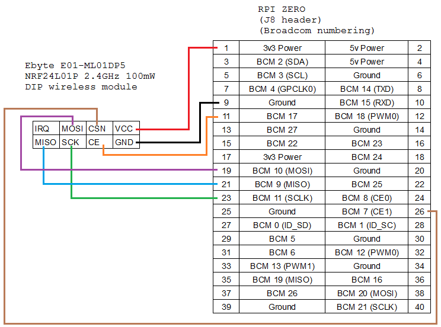

# Installation & user guide 
## Introduction
This guide is based on the Python version of [RF24 library](https://github.com/hzjian123/pynrf24) for NRF24L01+ RF module 
## Requirements
### Software
* Same from the link above ( not required for Raspbian )
* Numpy (for data recording)
* Matplotlib (optional)
### Hardware
* Raspberry Pi
* Nrf24l01+
* accessories
## Connection


## Installation
### List of files
* ``send.py`` Main function for senders.
* ``recv.py`` Main function for the receiver.
* ``command.sh`` Include all functions for the master.
* ``ploter.py`` Plotting function for the master.
* ``lib_nrf24.py`` Library function for all nodes.
* ``conf.txt`` Number of each node (0~10)
* ``conf.txt`` Stands for: 

|Meaning|Variables in ``confs.txt``|
| - | - |
|Speed selection|fixspd|
|backoff window lowerbound|windown|
|backoff window upperbound|winup|
|number of packages in the whole *super frame*|datalen|
|time limit for each SSH session|tlim|
|delay of the main function|delay|
|merge pos|position when merge happens|
### Structure
Super frame = ``spd pack`` + ``delay`` + n*``content pack``

*``spd pack``: Decide speed of the following packages. It uses the lowest speed.([speed,node number, merge flag])
*``delay``:plz use code to calculate
*``content pack``: a list with 32 bytes 

### Steps
* Name all Raspberry Pi as *node n[^n] and set node 0 as the receiver, node 1~10 as the senders.
[^n]: 0-10 in our case
* Connect all nodes to the same Access Point (can be one Raspberry Pi) and obtain all IP address.
* Put all IP into ``hosts.txt`` so that the lowest IP stands for the receiver such as the one below.
```
192.168.88.116
192.168.88.117
192.168.88.118
################
```
* Create another file ``hosts2.txt`` and include all IP that you want to have the delay.
* Send ``conf.txt`` to the all to assign node number.
* Send ``send.py`` to all but the receiver (uncomment ``send`` in ``command.sh`` and call by``./command.sh``).
* Send ``recv.py`` to the receiver and change the name to ``send.py``.
* Call ``main`` in ``command.sh``.
* Obtain data from the senders.
  
* Use ``plot`` in ``command.sh`` to obtain thoughtput data from receiver.
  
|File|Meaning|Data length|
| - | - | - |
|cd.npy|Carrier Detection (0 or 1) |time slots|
|acks.npy|Sender receive ack or not|number of packages sent|
|spds.npy|Speed selection|number of packages sent|
|wins.npy,winsact.npy|backoff window selection| number of packages sent|

## Test result
s
### Format
|Params|meaning|
| - | - |
|All ``m``|Number of received packages from receiver|
success ``n``|Number of successfully received packages|
|Accp rate |``n/m``|
 [a, b, c, d, e]|packages received from each nodes(1~10)|
 |fails|Times of fail to catch spd package|
 |throu ``j`` |Throughput|
 |(``k``)|Successful rate at node 1(sender)|
 For example: ``All 500 success 460 Accp rate 0.92 [460, 0, 0, 0, 0, 0, 0, 0, 0, 0, 0, 0] fails 0 throu 13.819 (0.81``
### Initially 5->1,then 10->1
* ``cd,spds,acks,wins,winsact(1~3)`` Data from the senders 
* ``ts10to5_n.npy`` Throughput records
* Results: ``All 4000 success 1902 Accp rate 0.4755 [321, 342, 326, 359, 355, 51, 15, 16, 37, 80, 0, 0] fails 0 throu 6.33 (0.19/0.05``
``All 4000 success 1930 Accp rate 0.4825 [310, 346, 345, 343, 383, 62, 19, 26, 27, 69, 0, 0] fails 0 throu 6.493 Merge pos ``
### 1->1
* File: ``ts.npy``
* Result: ``All 500 success 463 Accp rate 0.926 [463, 0, 0, 0, 0, 0, 0, 0, 0, 0, 0, 0] fails 0 throu 12.830785002681203 (0.87)``
### 3->1
* Results: ``All 2000 success 1272 Accp rate 0.636 [377, 482, 413, 0, 0, 0, 0, 0, 0, 0, 0, 0] fails 0 throu 8.638 (0.3``
``All 2000 success 1295 Accp rate 0.6475 [362, 523, 410, 0, 0, 0, 0, 0, 0, 0, 0, 0] fails 0 throu 8.565 (0.33``
### 10->1
* ``ts10.npy``
* Results" ``All 2000 success 617 Accp rate 0.3085 [75, 90, 95, 76, 97, 48, 18, 26, 7, 85, 0, 0] fails 0 throu 4.183 (0.08``
``All 2000 success 703 Accp rate 0.3515 [88, 103, 106, 86, 99, 61, 32, 23, 28, 77, 0, 0] fails 0 throu 4.604 (0.08``
### Constant speed
#### 250Kb
* Result: ``All 500 success 479 Accp rate 0.958 [479, 0, 0, 0, 0, 0, 0, 0, 0, 0, 0, 0] fails 0 throu 12.064160309909484 (0.88``
``All 500 success 440 Accp rate 0.88 [440, 0, 0, 0, 0, 0, 0, 0, 0, 0, 0, 0] fails 0 throu 10.63986680306113 (0.8``
``All 500 success 436 Accp rate 0.872 [436, 0, 0, 0, 0, 0, 0, 0, 0, 0, 0, 0] fails 0 throu 10.182416244857752 9( 0.77``
#### 1Mb
* Results: ``All 500 success 470 Accp rate 0.94 [470, 0, 0, 0, 0, 0, 0, 0, 0, 0, 0, 0] fails 0 throu 15.132323312179262 (0.87``
``All 500 success 475 Accp rate 0.95 [475, 0, 0, 0, 0, 0, 0, 0, 0, 0, 0, 0] fails 0 throu 15.753244993355121 (0.87``
``All 500 success 479 Accp rate 0.958 [479, 0, 0, 0, 0, 0, 0, 0, 0, 0, 0, 0] fails 0 throu 15.446(0.88``

#### 2Mb
* Results:``All 500 success 472 Accp rate 0.944 [472, 0, 0, 0, 0, 0, 0, 0, 0, 0, 0, 0] fails 0 throu 16.305350756311196 (0.88``
``All 500 success 459 Accp rate 0.918 [459, 0, 0, 0, 0, 0, 0, 0, 0, 0, 0, 0] fails 0 throu 14.887 (0.88``
``All 500 success 460 Accp rate 0.92 [460, 0, 0, 0, 0, 0, 0, 0, 0, 0, 0, 0] fails 0 throu 13.819 (0.81``
* ## MATLAB simulation
### Intro
* ``collision.m`` Call ``Bianchi_eqns.m`` to getn ideal data loss 
* ``cd.m`` FFT analysis for carrier detection.
* ``CSMA.m``Main function for simulation. 